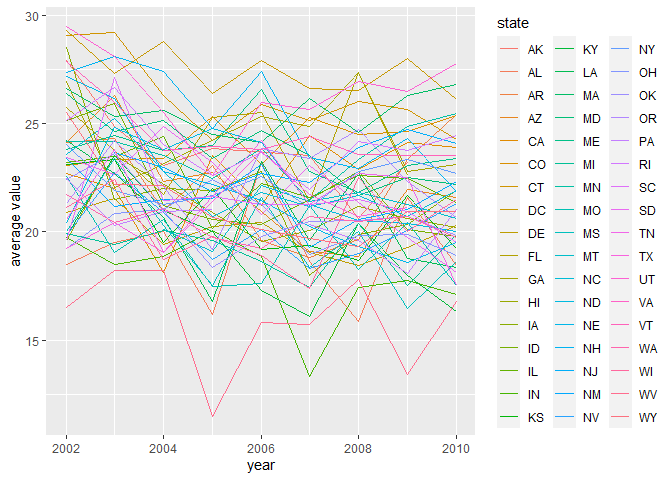
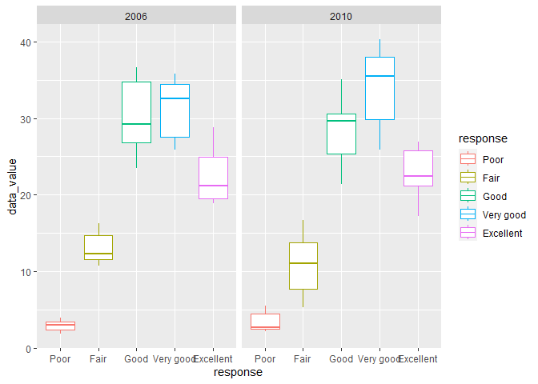
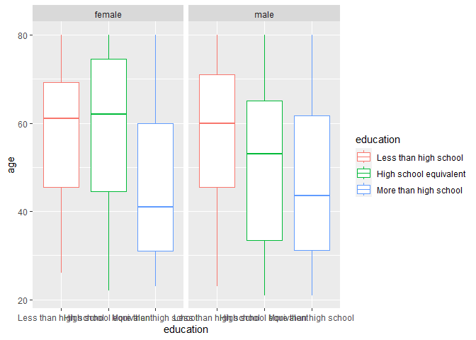
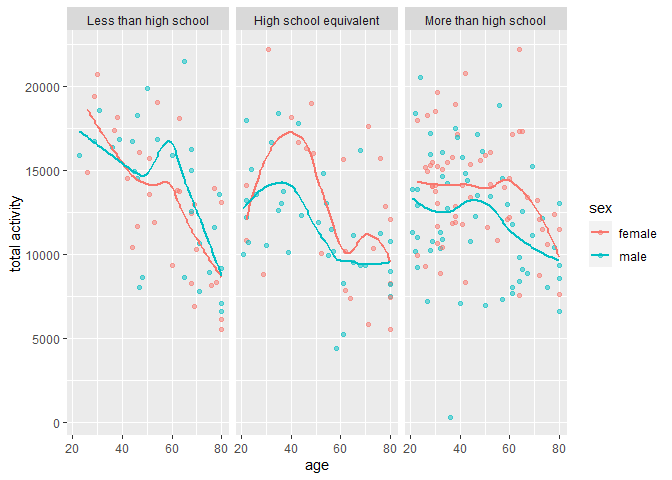
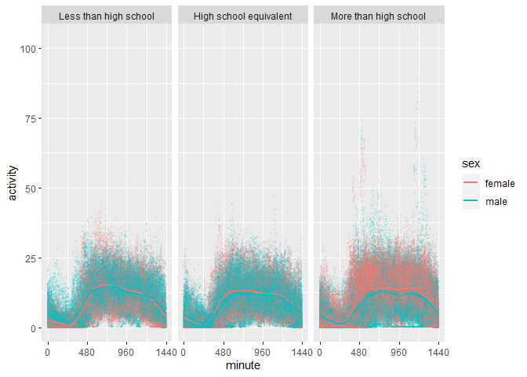

p8105_hw3_mc5503
================
mc5503
2023-10-08

``` r
library(tidyverse)
```

    ## ── Attaching core tidyverse packages ──────────────────────── tidyverse 2.0.0 ──
    ## ✔ dplyr     1.1.3     ✔ readr     2.1.4
    ## ✔ forcats   1.0.0     ✔ stringr   1.5.0
    ## ✔ ggplot2   3.4.3     ✔ tibble    3.2.1
    ## ✔ lubridate 1.9.2     ✔ tidyr     1.3.0
    ## ✔ purrr     1.0.2     
    ## ── Conflicts ────────────────────────────────────────── tidyverse_conflicts() ──
    ## ✖ dplyr::filter() masks stats::filter()
    ## ✖ dplyr::lag()    masks stats::lag()
    ## ℹ Use the conflicted package (<http://conflicted.r-lib.org/>) to force all conflicts to become errors

``` r
library(p8105.datasets)
data("instacart")
```

# Problem 1

The size of the dataset is 1384617 \*15. Each order contains serveral
products. One product belongs to one aisle and one department. For
example, order 1 is in Thursday, the customer bought 8 things.Bulgarian
Yogurt belongs to yogurt and the dairy eggs department.

``` r
str(instacart)
```

    ## tibble [1,384,617 × 15] (S3: tbl_df/tbl/data.frame)
    ##  $ order_id              : int [1:1384617] 1 1 1 1 1 1 1 1 36 36 ...
    ##  $ product_id            : int [1:1384617] 49302 11109 10246 49683 43633 13176 47209 22035 39612 19660 ...
    ##  $ add_to_cart_order     : int [1:1384617] 1 2 3 4 5 6 7 8 1 2 ...
    ##  $ reordered             : int [1:1384617] 1 1 0 0 1 0 0 1 0 1 ...
    ##  $ user_id               : int [1:1384617] 112108 112108 112108 112108 112108 112108 112108 112108 79431 79431 ...
    ##  $ eval_set              : chr [1:1384617] "train" "train" "train" "train" ...
    ##  $ order_number          : int [1:1384617] 4 4 4 4 4 4 4 4 23 23 ...
    ##  $ order_dow             : int [1:1384617] 4 4 4 4 4 4 4 4 6 6 ...
    ##  $ order_hour_of_day     : int [1:1384617] 10 10 10 10 10 10 10 10 18 18 ...
    ##  $ days_since_prior_order: int [1:1384617] 9 9 9 9 9 9 9 9 30 30 ...
    ##  $ product_name          : chr [1:1384617] "Bulgarian Yogurt" "Organic 4% Milk Fat Whole Milk Cottage Cheese" "Organic Celery Hearts" "Cucumber Kirby" ...
    ##  $ aisle_id              : int [1:1384617] 120 108 83 83 95 24 24 21 2 115 ...
    ##  $ department_id         : int [1:1384617] 16 16 4 4 15 4 4 16 16 7 ...
    ##  $ aisle                 : chr [1:1384617] "yogurt" "other creams cheeses" "fresh vegetables" "fresh vegetables" ...
    ##  $ department            : chr [1:1384617] "dairy eggs" "dairy eggs" "produce" "produce" ...
    ##  - attr(*, "spec")=
    ##   .. cols(
    ##   ..   order_id = col_integer(),
    ##   ..   product_id = col_integer(),
    ##   ..   add_to_cart_order = col_integer(),
    ##   ..   reordered = col_integer(),
    ##   ..   user_id = col_integer(),
    ##   ..   eval_set = col_character(),
    ##   ..   order_number = col_integer(),
    ##   ..   order_dow = col_integer(),
    ##   ..   order_hour_of_day = col_integer(),
    ##   ..   days_since_prior_order = col_integer(),
    ##   ..   product_name = col_character(),
    ##   ..   aisle_id = col_integer(),
    ##   ..   department_id = col_integer(),
    ##   ..   aisle = col_character(),
    ##   ..   department = col_character()
    ##   .. )

## analysis of aisle

``` r
aisle_n=instacart|>
  count(aisle,name="n_items")|>
  arrange(desc(n_items))
```

There are total 134 aisles and the fresh vegetables aisle is the most
items ordered from.

## number of items ordered in each aisle

``` r
instacart |> 
  count(aisle,name="n_items")|>
  arrange(desc(n_items))|>
  filter(n_items>10000)|>
  mutate(aisle = forcats::fct_reorder(aisle, desc(n_items)))|>
  ggplot(aes(y=n_items,x=aisle))+
  geom_col()+
  theme(axis.text.x = element_text(angle = 90, hjust = 1, vjust = .5))
```

<!-- -->

fresh fruits and vegetables are the two most popular aisles.

## popular items

``` r
bi=
  instacart|>
  filter(aisle=="baking ingredients")|>
  count(product_name, name = "n_items")|>
  arrange(desc(n_items))|>
  head(n=3L)
knitr::kable(bi)
```

| product_name      | n_items |
|:------------------|--------:|
| Light Brown Sugar |     499 |
| Pure Baking Soda  |     387 |
| Cane Sugar        |     336 |

``` r
dfc=
  instacart|>
  filter(aisle=="dog food care")|>
  count(product_name, name = "n_items")|>
  arrange(desc(n_items))|>
  head(n=3L)
knitr::kable(dfc)
```

| product_name                                  | n_items |
|:----------------------------------------------|--------:|
| Snack Sticks Chicken & Rice Recipe Dog Treats |      30 |
| Organix Chicken & Brown Rice Recipe           |      28 |
| Small Dog Biscuits                            |      26 |

``` r
pvf=
  instacart|>
  filter(aisle=="packaged vegetables fruits")|>
  count(product_name, name = "n_items")|>
  arrange(desc(n_items))|>
  head(n=3L)
knitr::kable(pvf)
```

| product_name         | n_items |
|:---------------------|--------:|
| Organic Baby Spinach |    9784 |
| Organic Raspberries  |    5546 |
| Organic Blueberries  |    4966 |

The 3 most popular items in baking ingredients is Light Brown Sugar,
Pure Baking Soda, Cane Sugar.The 3 most popular items in dog food care
is Snack Sticks Chicken & Rice Recipe Dog Treats, Organix Chicken &
Brown Rice Recipe, Small Dog Biscuits. The 3 most popular items in
packaged vegetables fruits is Organic Baby Spinach, Organic Raspberries,
Organic Blueberries.

## mean hour of the day

``` r
instacart|>
  filter(product_name %in% c("Pink Lady Apples","Coffee Ice Cream"))|>
  group_by(product_name,order_dow)|>
  summarize(
    mean_hour_of_the_day=mean(order_hour_of_day))|>
  pivot_wider(
    names_from = order_dow,
    values_from = mean_hour_of_the_day
  )|> 
  rename("Sunday"="0","Monday"="1","Tuesday"="2","Wednesday"="3","Thursday"="4","Friday"="5","Saturdy"="6")|>
  knitr::kable(digits = 1)
```

    ## `summarise()` has grouped output by 'product_name'. You can override using the
    ## `.groups` argument.

| product_name     | Sunday | Monday | Tuesday | Wednesday | Thursday | Friday | Saturdy |
|:-----------------|-------:|-------:|--------:|----------:|---------:|-------:|--------:|
| Coffee Ice Cream |   13.8 |   14.3 |    15.4 |      15.3 |     15.2 |   12.3 |    13.8 |
| Pink Lady Apples |   13.4 |   11.4 |    11.7 |      14.2 |     11.6 |   12.8 |    11.9 |

Use `group_by` and `summarize` to calculate the mean hour of the day for
each day in one week. In average, the mean hour of the day of Coffee Ice
Cream is longer.

# Problem 2

## data cleaning

``` r
data("brfss_smart2010")

ps_clean=
  brfss_smart2010|>
  janitor::clean_names()|>
  filter(topic=='Overall Health')|>
  filter(response %in% c("Excellent","Very good","Good","Fair","Poor"))|>
  mutate(response= forcats::fct_relevel(response, c("Poor", "Fair", "Good","Very good","Excellent")))|>
  rename("state"="locationabbr","location"="locationdesc")
```

## states observed at 7 or more locations

``` r
ps_clean|>
  filter(year=='2002')|>
  group_by(state)|>
  summarize(n_days=n_distinct(location))|>
  filter(n_days>6)|>
  knitr::kable()
```

| state | n_days |
|:------|-------:|
| CT    |      7 |
| FL    |      7 |
| MA    |      8 |
| NC    |      7 |
| NJ    |      8 |
| PA    |     10 |

``` r
ps_clean|>
  filter(year=='2010')|>
  group_by(state)|>
  summarize(n_days=n_distinct(location))|>
  filter(n_days>6)|>
  knitr::kable()
```

| state | n_days |
|:------|-------:|
| CA    |     12 |
| CO    |      7 |
| FL    |     41 |
| MA    |      9 |
| MD    |     12 |
| NC    |     12 |
| NE    |     10 |
| NJ    |     19 |
| NY    |      9 |
| OH    |      8 |
| PA    |      7 |
| SC    |      7 |
| TX    |     16 |
| WA    |     10 |

In 2002, there are 6 states which were observed at 7 or more locations.
In 2010, there are 14 states which were observed at 7 or more locations.

## plot for average data value

``` r
data_spaghetti=ps_clean|>
  filter(response=="Excellent")|>
  select(year,state,location,data_value)|>
  group_by(year,state)|>
  summarize(
    avg_value=mean(data_value)
  )
```

    ## `summarise()` has grouped output by 'year'. You can override using the
    ## `.groups` argument.

``` r
data_spaghetti|>
  ggplot(aes(x=year,y=avg_value,group=state))+
  geom_line(aes(color=state))+
  labs(y="average value")
```

    ## Warning: Removed 3 rows containing missing values (`geom_line()`).

<!-- -->

The average values for different states from 2002 to 2010 is between 10
and 30.

## two-panel plot

``` r
ps_clean|>
  filter(year %in% c("2006","2010"),state=="NY")|>
  select(year,state,location,response,data_value)|>
  ggplot(aes(x=response,y=data_value,color=response))+
  geom_boxplot()+
  facet_grid(.~year)
```

<!-- -->

From the plot, we can see that both in 2006 and 2010, most responses
were good and very good. The data value for answer of good, very good,
excellent all increased from 2006 to 2010.

# Problem 3

## data manipulation

``` r
demo_data=read_csv("data/nhanes_covar.csv",skip=4)
```

    ## Rows: 250 Columns: 5
    ## ── Column specification ────────────────────────────────────────────────────────
    ## Delimiter: ","
    ## dbl (5): SEQN, sex, age, BMI, education
    ## 
    ## ℹ Use `spec()` to retrieve the full column specification for this data.
    ## ℹ Specify the column types or set `show_col_types = FALSE` to quiet this message.

``` r
acce_data=read_csv("data/nhanes_accel.csv")
```

    ## Rows: 250 Columns: 1441
    ## ── Column specification ────────────────────────────────────────────────────────
    ## Delimiter: ","
    ## dbl (1441): SEQN, min1, min2, min3, min4, min5, min6, min7, min8, min9, min1...
    ## 
    ## ℹ Use `spec()` to retrieve the full column specification for this data.
    ## ℹ Specify the column types or set `show_col_types = FALSE` to quiet this message.

``` r
data_clean=demo_data|>
  filter(age>=21)|>
  drop_na()|>
  mutate(sex=recode(sex,"1"="male","2"="female"))|>
  mutate(education=recode(education,"1"="Less than high school","2"="High school equivalent","3"="More than high school"))|>
  mutate(education= forcats::fct_relevel(education, c("Less than high school", "High school equivalent", "More than high school")))|>
  left_join(acce_data,by="SEQN")
```

## analysis for demographic data

``` r
data_clean|>
  group_by(sex,education)|>
  summarize(n_people=n())|>
  pivot_wider(
    names_from = education,
    values_from = n_people
  )|>
  knitr::kable()
```

    ## `summarise()` has grouped output by 'sex'. You can override using the `.groups`
    ## argument.

| sex    | Less than high school | High school equivalent | More than high school |
|:-------|----------------------:|-----------------------:|----------------------:|
| female |                    28 |                     23 |                    59 |
| male   |                    27 |                     35 |                    56 |

``` r
data_clean|>
  ggplot(aes(x=education,y=age,color=education))+
  geom_boxplot()+
  facet_grid(.~sex)
```

<!-- -->

There are total 118 male and 110 female in the study. From the plot,
it’s obvious that the younger people tend to have higher education.

## total activities plot

``` r
data_clean|>
   mutate(total_act = rowSums(across(min1:min1440)))|>
  ggplot(aes(x=age,y=total_act,color=sex))+
  geom_point(alpha=0.5)+
  geom_smooth(se=FALSE)+
  labs(y="total activity")+
  facet_grid(.~education)
```

    ## `geom_smooth()` using method = 'loess' and formula = 'y ~ x'

<!-- -->
From the plot, the total activity decrease with age in general.In group
of less than high school, the total activity of male is higher than
female, while in other two groups the results are opposite.

## activity over the course of the day

``` r
data_clean|>
  pivot_longer(
    min1:min1440,
    names_to = "time",
    values_to = "activity"
  )|>
  separate(time,into = c("unit","minute"),sep = 3)|>
  mutate(minute=as.numeric(minute))|>
  ggplot(aes(x=minute,y=activity,color=sex))+
  geom_point(alpha=0.1,size=0.1)+
  geom_smooth(se=FALSE)+
  scale_x_continuous(
    breaks = c(0, 480, 960,1440), 
    #labels = c("-15ºC", "0", "15"),
    limits = c(0,1440))+
  facet_grid(.~education)
```

    ## `geom_smooth()` using method = 'gam' and formula = 'y ~ s(x, bs = "cs")'

<!-- -->

From the plot, we can tell that in group of High school equivalent and
More than high school, female have more activity than male. And people
have more activity when it’s 8am to 8 pm which is between 480 to 1200
minutes.
