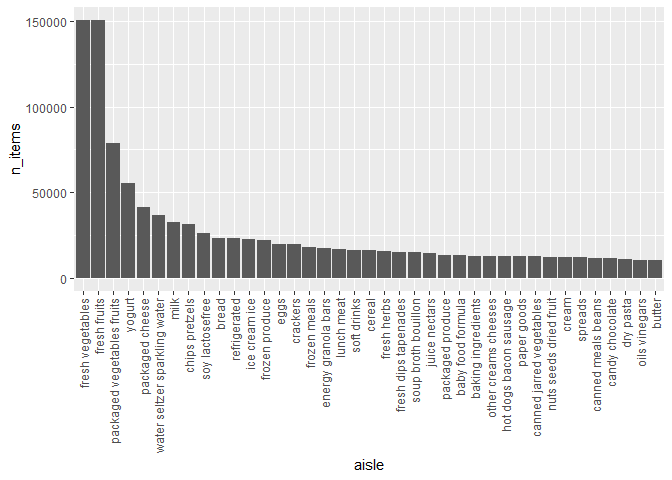

p8105_hw3_mc5503
================
mc5503
2023-10-08

``` r
library(tidyverse)
```

    ## ── Attaching core tidyverse packages ──────────────────────── tidyverse 2.0.0 ──
    ## ✔ dplyr     1.1.3     ✔ readr     2.1.4
    ## ✔ forcats   1.0.0     ✔ stringr   1.5.0
    ## ✔ ggplot2   3.4.3     ✔ tibble    3.2.1
    ## ✔ lubridate 1.9.2     ✔ tidyr     1.3.0
    ## ✔ purrr     1.0.2     
    ## ── Conflicts ────────────────────────────────────────── tidyverse_conflicts() ──
    ## ✖ dplyr::filter() masks stats::filter()
    ## ✖ dplyr::lag()    masks stats::lag()
    ## ℹ Use the conflicted package (<http://conflicted.r-lib.org/>) to force all conflicts to become errors

``` r
library(p8105.datasets)
data("instacart")
```

# Problem 1

## analysis of aisle

``` r
aisle_n=instacart|>
  count(aisle,name="n_items")|>
  arrange(desc(n_items))
```

there are total 134 aisles and the fresh vegetables aisle is the most
items ordered from.

## number of items ordered in each aisle

``` r
instacart |> 
  count(aisle,name="n_items")|>
  arrange(desc(n_items))|>
  filter(n_items>10000)|>
  mutate(aisle = forcats::fct_reorder(aisle, desc(n_items)))|>
  ggplot(aes(y=n_items,x=aisle))+
  geom_col()+
  theme(axis.text.x = element_text(angle = 90, hjust = 1, vjust = .5))
```

<!-- -->

fresh fruits and vegetables are the two most popular aisles.

## 

``` r
bi=
  instacart|>
  filter(aisle=="baking ingredients")|>
  count(product_name, name = "n_items")|>
  arrange(desc(n_items))|>
  head(n=3L)
knitr::kable(bi)
```

| product_name      | n_items |
|:------------------|--------:|
| Light Brown Sugar |     499 |
| Pure Baking Soda  |     387 |
| Cane Sugar        |     336 |

``` r
dfc=
  instacart|>
  filter(aisle=="dog food care")|>
  count(product_name, name = "n_items")|>
  arrange(desc(n_items))|>
  head(n=3L)
knitr::kable(dfc)
```

| product_name                                  | n_items |
|:----------------------------------------------|--------:|
| Snack Sticks Chicken & Rice Recipe Dog Treats |      30 |
| Organix Chicken & Brown Rice Recipe           |      28 |
| Small Dog Biscuits                            |      26 |

``` r
pvf=
  instacart|>
  filter(aisle=="packaged vegetables fruits")|>
  count(product_name, name = "n_items")|>
  arrange(desc(n_items))|>
  head(n=3L)
knitr::kable(pvf)
```

| product_name         | n_items |
|:---------------------|--------:|
| Organic Baby Spinach |    9784 |
| Organic Raspberries  |    5546 |
| Organic Blueberries  |    4966 |

The 3 most popular items in baking ingredients is Light Brown Sugar,
Pure Baking Soda, Cane Sugar.The 3 most popular items in dog food care
is Snack Sticks Chicken & Rice Recipe Dog Treats, Organix Chicken &
Brown Rice Recipe, Small Dog Biscuits. The 3 most popular items in
packaged vegetables fruits is Organic Baby Spinach, Organic Raspberries,
Organic Blueberries.
