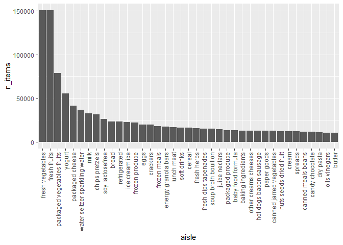

p8105_hw3_mc5503
================
mc5503
2023-10-08

``` r
library(tidyverse)
```

    ## ── Attaching core tidyverse packages ──────────────────────── tidyverse 2.0.0 ──
    ## ✔ dplyr     1.1.3     ✔ readr     2.1.4
    ## ✔ forcats   1.0.0     ✔ stringr   1.5.0
    ## ✔ ggplot2   3.4.3     ✔ tibble    3.2.1
    ## ✔ lubridate 1.9.2     ✔ tidyr     1.3.0
    ## ✔ purrr     1.0.2     
    ## ── Conflicts ────────────────────────────────────────── tidyverse_conflicts() ──
    ## ✖ dplyr::filter() masks stats::filter()
    ## ✖ dplyr::lag()    masks stats::lag()
    ## ℹ Use the conflicted package (<http://conflicted.r-lib.org/>) to force all conflicts to become errors

``` r
library(p8105.datasets)
data("instacart")
```

# Problem 1

The size of the dataset is 1384617 \*15. Each order contains serveral
products. One product belongs to one aisle and one department. For
example, order 1 is in Thursday, the customer bought 8 things.Bulgarian
Yogurt belongs to yogurt and the dairy eggs department.

``` r
str(instacart)
```

    ## tibble [1,384,617 × 15] (S3: tbl_df/tbl/data.frame)
    ##  $ order_id              : int [1:1384617] 1 1 1 1 1 1 1 1 36 36 ...
    ##  $ product_id            : int [1:1384617] 49302 11109 10246 49683 43633 13176 47209 22035 39612 19660 ...
    ##  $ add_to_cart_order     : int [1:1384617] 1 2 3 4 5 6 7 8 1 2 ...
    ##  $ reordered             : int [1:1384617] 1 1 0 0 1 0 0 1 0 1 ...
    ##  $ user_id               : int [1:1384617] 112108 112108 112108 112108 112108 112108 112108 112108 79431 79431 ...
    ##  $ eval_set              : chr [1:1384617] "train" "train" "train" "train" ...
    ##  $ order_number          : int [1:1384617] 4 4 4 4 4 4 4 4 23 23 ...
    ##  $ order_dow             : int [1:1384617] 4 4 4 4 4 4 4 4 6 6 ...
    ##  $ order_hour_of_day     : int [1:1384617] 10 10 10 10 10 10 10 10 18 18 ...
    ##  $ days_since_prior_order: int [1:1384617] 9 9 9 9 9 9 9 9 30 30 ...
    ##  $ product_name          : chr [1:1384617] "Bulgarian Yogurt" "Organic 4% Milk Fat Whole Milk Cottage Cheese" "Organic Celery Hearts" "Cucumber Kirby" ...
    ##  $ aisle_id              : int [1:1384617] 120 108 83 83 95 24 24 21 2 115 ...
    ##  $ department_id         : int [1:1384617] 16 16 4 4 15 4 4 16 16 7 ...
    ##  $ aisle                 : chr [1:1384617] "yogurt" "other creams cheeses" "fresh vegetables" "fresh vegetables" ...
    ##  $ department            : chr [1:1384617] "dairy eggs" "dairy eggs" "produce" "produce" ...
    ##  - attr(*, "spec")=
    ##   .. cols(
    ##   ..   order_id = col_integer(),
    ##   ..   product_id = col_integer(),
    ##   ..   add_to_cart_order = col_integer(),
    ##   ..   reordered = col_integer(),
    ##   ..   user_id = col_integer(),
    ##   ..   eval_set = col_character(),
    ##   ..   order_number = col_integer(),
    ##   ..   order_dow = col_integer(),
    ##   ..   order_hour_of_day = col_integer(),
    ##   ..   days_since_prior_order = col_integer(),
    ##   ..   product_name = col_character(),
    ##   ..   aisle_id = col_integer(),
    ##   ..   department_id = col_integer(),
    ##   ..   aisle = col_character(),
    ##   ..   department = col_character()
    ##   .. )

## analysis of aisle

``` r
aisle_n=instacart|>
  count(aisle,name="n_items")|>
  arrange(desc(n_items))
```

There are total 134 aisles and the fresh vegetables aisle is the most
items ordered from.

## number of items ordered in each aisle

``` r
instacart |> 
  count(aisle,name="n_items")|>
  arrange(desc(n_items))|>
  filter(n_items>10000)|>
  mutate(aisle = forcats::fct_reorder(aisle, desc(n_items)))|>
  ggplot(aes(y=n_items,x=aisle))+
  geom_col()+
  theme(axis.text.x = element_text(angle = 90, hjust = 1, vjust = .5))
```

<!-- -->

fresh fruits and vegetables are the two most popular aisles.

## popular items

``` r
bi=
  instacart|>
  filter(aisle=="baking ingredients")|>
  count(product_name, name = "n_items")|>
  arrange(desc(n_items))|>
  head(n=3L)
knitr::kable(bi)
```

| product_name      | n_items |
|:------------------|--------:|
| Light Brown Sugar |     499 |
| Pure Baking Soda  |     387 |
| Cane Sugar        |     336 |

``` r
dfc=
  instacart|>
  filter(aisle=="dog food care")|>
  count(product_name, name = "n_items")|>
  arrange(desc(n_items))|>
  head(n=3L)
knitr::kable(dfc)
```

| product_name                                  | n_items |
|:----------------------------------------------|--------:|
| Snack Sticks Chicken & Rice Recipe Dog Treats |      30 |
| Organix Chicken & Brown Rice Recipe           |      28 |
| Small Dog Biscuits                            |      26 |

``` r
pvf=
  instacart|>
  filter(aisle=="packaged vegetables fruits")|>
  count(product_name, name = "n_items")|>
  arrange(desc(n_items))|>
  head(n=3L)
knitr::kable(pvf)
```

| product_name         | n_items |
|:---------------------|--------:|
| Organic Baby Spinach |    9784 |
| Organic Raspberries  |    5546 |
| Organic Blueberries  |    4966 |

The 3 most popular items in baking ingredients is Light Brown Sugar,
Pure Baking Soda, Cane Sugar.The 3 most popular items in dog food care
is Snack Sticks Chicken & Rice Recipe Dog Treats, Organix Chicken &
Brown Rice Recipe, Small Dog Biscuits. The 3 most popular items in
packaged vegetables fruits is Organic Baby Spinach, Organic Raspberries,
Organic Blueberries.

## mean hour of the day

``` r
instacart|>
  filter(product_name %in% c("Pink Lady Apples","Coffee Ice Cream"))|>
  group_by(product_name,order_dow)|>
  summarize(
    mean_hour_of_the_day=mean(order_hour_of_day))|>
  pivot_wider(
    names_from = order_dow,
    values_from = mean_hour_of_the_day
  )|> 
  rename("Sunday"="0","Monday"="1","Tuesday"="2","Wednesday"="3","Thursday"="4","Friday"="5","Saturdy"="6")|>
  knitr::kable(digits = 1)
```

    ## `summarise()` has grouped output by 'product_name'. You can override using the
    ## `.groups` argument.

| product_name     | Sunday | Monday | Tuesday | Wednesday | Thursday | Friday | Saturdy |
|:-----------------|-------:|-------:|--------:|----------:|---------:|-------:|--------:|
| Coffee Ice Cream |   13.8 |   14.3 |    15.4 |      15.3 |     15.2 |   12.3 |    13.8 |
| Pink Lady Apples |   13.4 |   11.4 |    11.7 |      14.2 |     11.6 |   12.8 |    11.9 |

Use `group_by` and `summarize` to calculate the mean hour of the day for
each day in one week. In average, the mean hour of the day of Coffee Ice
Cream is longer.

# Problem 2

``` r
data("brfss_smart2010")
```
